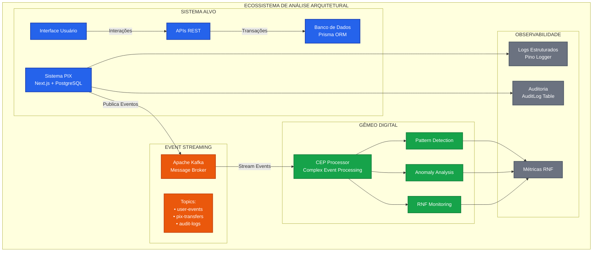
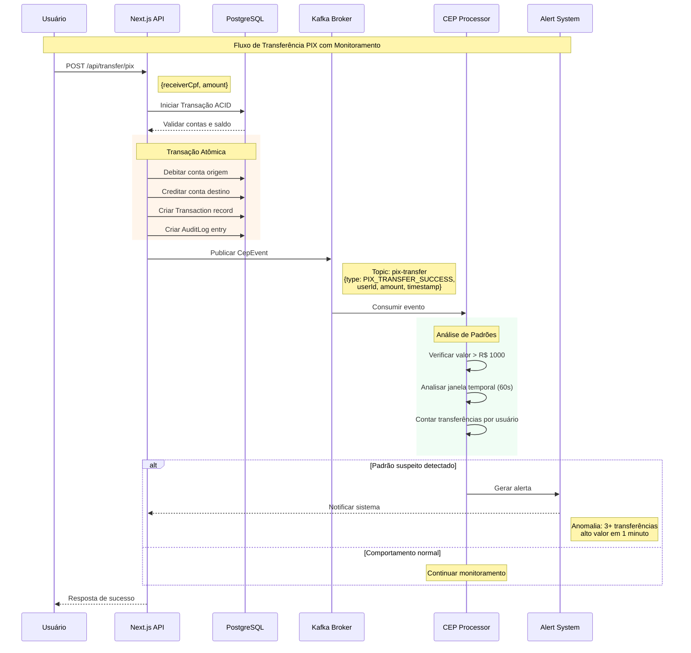
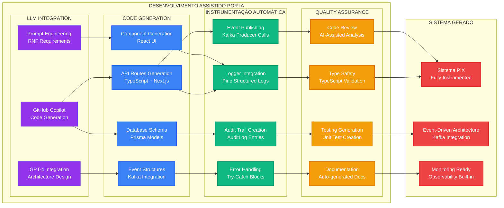
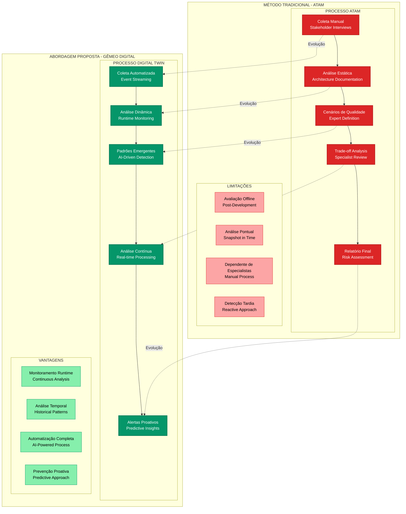

# Diagramas Mermaid - Sistema PIX com Gêmeo Digital

## DIAGRAMA 1: Arquitetura Conceitual Geral (Para Slide 3)



## DIAGRAMA 2: Arquitetura Detalhada em Camadas (Para Slide 5)

```mermaid
graph TB
    subgraph "CAMADA DE APRESENTAÇÃO"
        A1[Login Page<br/>React Component]
        A2[Dashboard<br/>Balance + Transactions]
        A3[Transfer PIX<br/>Form Component]
        A4[Extract View<br/>Transaction History]
    end

    subgraph "CAMADA DE NEGÓCIO - Next.js API Routes"
        B1["/api/auth/[...nextauth]<br/>NextAuth.js"]
        B2["/api/account/balance<br/>Consulta Saldo"]
        B3["/api/account/transactions<br/>Extrato"]
        B4["/api/transfer/pix<br/>Transferência PIX"]
        B5["/api/register<br/>Cadastro Usuário"]

        subgraph "EVENT PUBLISHER"
            EP[Kafka Producer<br/>publishCepEvent()]
        end
    end

    subgraph "MIDDLEWARE"
        C1[Apache Kafka Cluster]
        C2[Topics:<br/>• user-login<br/>• pix-transfer<br/>• account-balance<br/>• audit-events]
    end

    subgraph "CAMADA DE DADOS"
        subgraph "PostgreSQL Database"
            D1[User<br/>CPF, Email, Password]
            D2[Account<br/>Balance, User Relation]
            D3[Transaction<br/>Amount, Sender, Receiver]
            D4[AuditLog<br/>Action, Entity, Details]
        end

        subgraph "ORM"
            D5[Prisma Client<br/>Type-safe Database Access]
        end
    end

    subgraph "GÊMEO DIGITAL - CEP PROCESSOR"
        E1[Kafka Consumer<br/>Event Listener]
        E2[Pattern Detection<br/>High Value Transfers]
        E3[Time Window Analysis<br/>Suspicious Behavior]
        E4[Alert System<br/>Anomaly Notification]
    end

    A1 --> B1
    A2 --> B2
    A2 --> B3
    A3 --> B4
    A4 --> B3
    B5 --> EP

    B1 --> D5
    B2 --> D5
    B3 --> D5
    B4 --> D5
    B4 --> EP
    B5 --> D5

    D5 --> D1
    D5 --> D2
    D5 --> D3
    D5 --> D4

    EP --> C1
    C1 --> C2
    C2 --> E1
    E1 --> E2
    E1 --> E3
    E2 --> E4
    E3 --> E4

    classDef frontend fill:#3B82F6,stroke:#2563EB,stroke-width:2px,color:#ffffff
    classDef api fill:#8B5CF6,stroke:#7C3AED,stroke-width:2px,color:#ffffff
    classDef kafka fill:#EA580C,stroke:#c2410c,stroke-width:2px,color:#ffffff
    classDef database fill:#10B981,stroke:#059669,stroke-width:2px,color:#ffffff
    classDef cep fill:#F59E0B,stroke:#D97706,stroke-width:2px,color:#ffffff

    class A1,A2,A3,A4 frontend
    class B1,B2,B3,B4,B5,EP api
    class C1,C2 kafka
    class D1,D2,D3,D4,D5 database
    class E1,E2,E3,E4 cep
```

## DIAGRAMA 3: Fluxo de Eventos CEP (Para Slide 6)



## DIAGRAMA 4: Arquitetura de RNFs (Para Slide 7)

```mermaid
graph TB
    subgraph "REQUISITOS NÃO FUNCIONAIS IMPLEMENTADOS"
        subgraph "VOLUMETRIA"
            V1[Paginação Otimizada<br/>Limite por página]
            V2[Indexação PostgreSQL<br/>sender/receiver AccountId]
            V3[Query Optimization<br/>Prisma ORM]
        end

        subgraph "CONCORRÊNCIA"
            C1[Transações ACID<br/>prisma.$transaction]
            C2[Connection Pooling<br/>PostgreSQL Pool]
            C3[Concurrent Access Control<br/>Database Locks]
        end

        subgraph "RASTREABILIDADE"
            R1[Event Sourcing<br/>Kafka Topics]
            R2[Structured Logging<br/>Pino Logger]
            R3[Audit Trail<br/>AuditLog Table]
            R4[Correlation IDs<br/>Request Tracing]
        end

        subgraph "OBSERVABILIDADE"
            O1[Real-time Monitoring<br/>CEP Events]
            O2[Pattern Detection<br/>Behavioral Analysis]
            O3[Anomaly Alerts<br/>Suspicious Activity]
            O4[Performance Metrics<br/>Response Time, Throughput]
        end
    end

    subgraph "GÊMEO DIGITAL - ANÁLISE INTEGRADA"
        GD[Complex Event Processing<br/>Stream Analytics]

        subgraph "ANÁLISES REALIZADAS"
            A1[Análise Temporal<br/>Time Window Patterns]
            A2[Análise Comportamental<br/>User Activity Patterns]
            A3[Análise de Risco<br/>High Value Transfers]
            A4[Análise de Performance<br/>System Load Patterns]
        end
    end

    V1 --> GD
    V2 --> GD
    V3 --> GD
    C1 --> GD
    C2 --> GD
    C3 --> GD
    R1 --> GD
    R2 --> GD
    R3 --> GD
    R4 --> GD
    O1 --> GD
    O2 --> GD
    O3 --> GD
    O4 --> GD

    GD --> A1
    GD --> A2
    GD --> A3
    GD --> A4

    classDef volume fill:#3B82F6,stroke:#2563EB,stroke-width:2px,color:#ffffff
    classDef concor fill:#8B5CF6,stroke:#7C3AED,stroke-width:2px,color:#ffffff
    classDef rastrea fill:#10B981,stroke:#059669,stroke-width:2px,color:#ffffff
    classDef observ fill:#F59E0B,stroke:#D97706,stroke-width:2px,color:#ffffff
    classDef gemeo fill:#EF4444,stroke:#DC2626,stroke-width:2px,color:#ffffff
    classDef analise fill:#6B7280,stroke:#4B5563,stroke-width:2px,color:#ffffff

    class V1,V2,V3 volume
    class C1,C2,C3 concor
    class R1,R2,R3,R4 rastrea
    class O1,O2,O3,O4 observ
    class GD gemeo
    class A1,A2,A3,A4 analise
```



## DIAGRAMA 5: Integração LLM + Desenvolvimento (Para Slide 6 - Metodologia)



## DIAGRAMA 6: Comparação ATAM vs Gêmeo Digital (Para Slide 8)



---

## INSTRUÇÕES DE USO:

### Para gerar as imagens:

1. **Copie cada código Mermaid**
2. **Cole em ferramentas online:**
   - [Mermaid Live Editor](https://mermaid.live/)
   - [Draw.io](https://app.diagrams.net/) (suporta Mermaid)
   - VS Code com extensão Mermaid Preview

### Para cada slide:

- **Slide 3:** Diagrama 1 (Conceitual)
- **Slide 5:** Diagrama 2 (Camadas Detalhadas)
- **Slide 6:** Diagrama 3 (Fluxo CEP) + Diagrama 5 (LLM Integration)
- **Slide 7:** Diagrama 4 (RNFs)
- **Slide 8:** Diagrama 6 (Comparação ATAM)

### Fontes obrigatórias:

- "Fonte: Arquitetura desenvolvida pelo autor baseada no sistema implementado"
- "Fonte: Fluxo de eventos elaborado pelo autor"
- "Fonte: Framework metodológico proposto pelo autor"
- "Fonte: Análise comparativa elaborada pelo autor baseada em Kazman et al (2000)"
